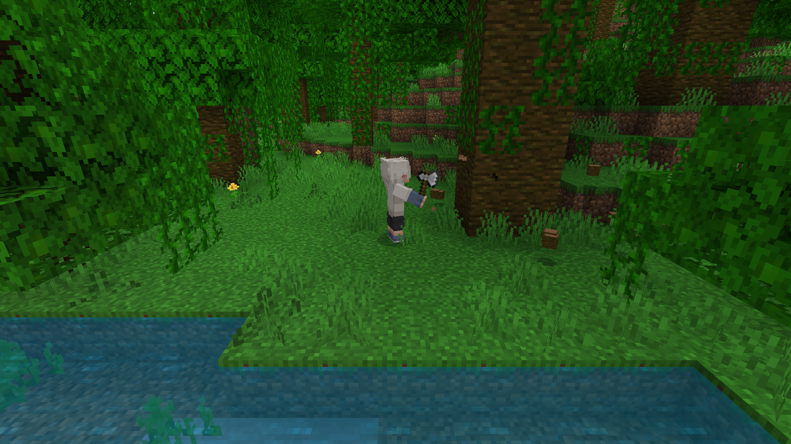
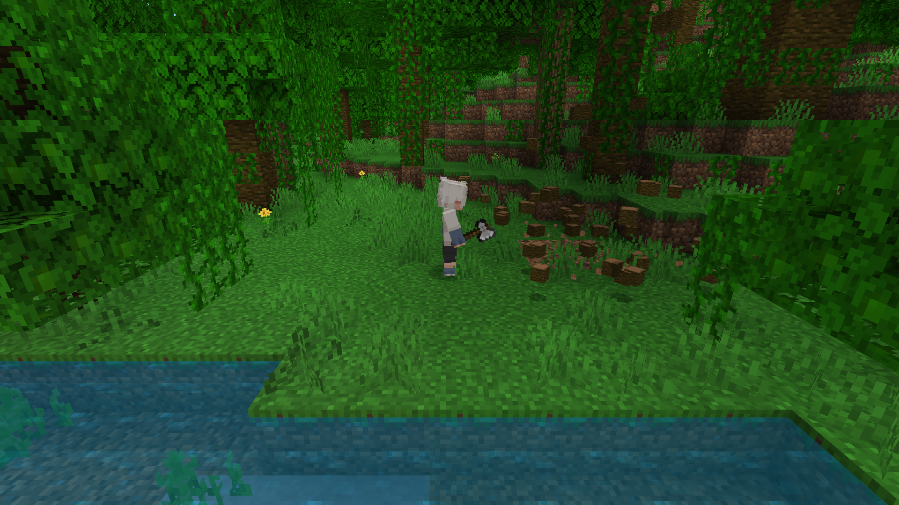
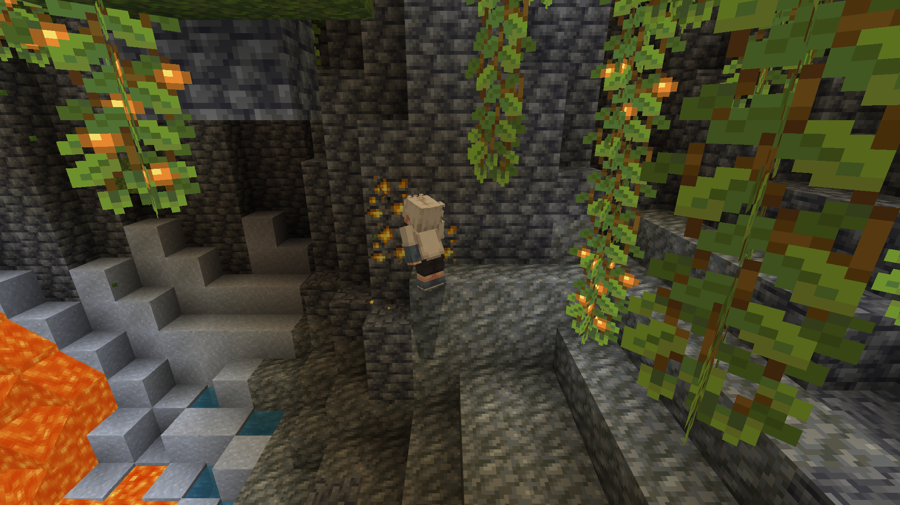
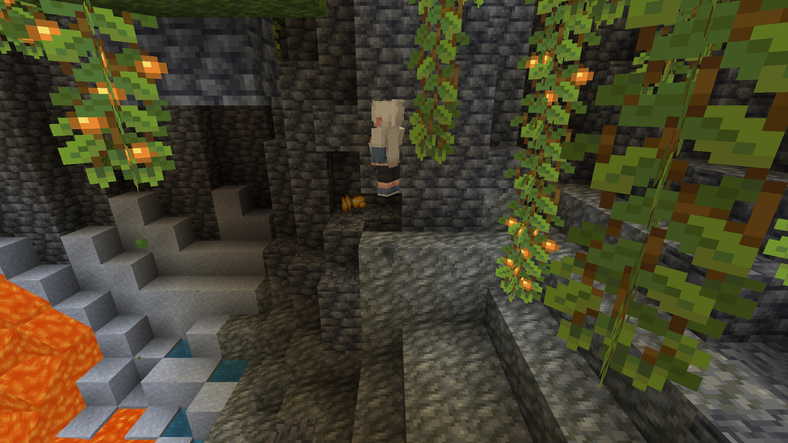
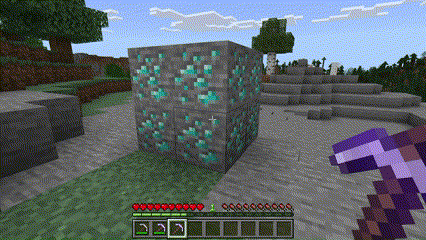
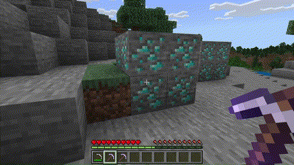

<h1> Minecraft Tree Capitator and Vein Miner Addon </h1>

This addon mod for Minecraft making resource gathering more efficient and convenient.

## Credits

This addon was created by @keyyard.

### Social Media:

- Twitter: [@keyyard](https://twitter.com/keyyard)
- Youtube: [keyyard](https://youtube.com/c/keyyard)

### Contributors:

- Worldwidebrine: commands in version 0.0.2
- [GlitchyTurtle](https://github.com/GlitchyTurtle): algorithms suggestion.
- [Trea Beane](https://github.com/TreaBeane): algorithms suggestion.

## Features

- **Tree Capitator:** Tree Capitative when using axes and sneaking.
- **Vein Miner:** Vein Mining when using pickaxes and sneaking.
- **Enchantment Support:** Supports enchantments like Fortunes, Unbreaking, Silk Touch.
- **Durability Drain:** Will drain item durability when used.
- **No Limit Optimized Performance:** The addon will not limit the number of blocks you can break from the chain but break them in turns so it won't lag your game as much as break all at once. The speed remain the same for most cases.
- **Both:** Both features will get activated when using the correct tools and sneaking.

## Tree Capitator

To activate Tree Capitator, please ensure you are using axes to chopping down trees.

- Break the bottom block of a tree, and the entire tree will fall down.
- Works for all types of trees, including birch, oak, jungle, etc.
- Works for nether trees, such as crimson and warped.
- Supports large and huge trees.
- Compatible with new tree types, like mangrove and cherry.
- **Note:** Tree Capitator will not work on mangrove roots to avoid damaging the biome.

## Vein Miner

To activate Vein Miner, please ensure you are using pickaxes to mining ores.

- Breaking a block in an ore chain will cause the entire chain to pop out.
- Works for all types of ores.
- Supports nether ores, including nether debris and gold.
- Works on gravels in the normal version.

## Enchantment Support

This addon supports enchantments like Fortune, Unbreaking, and Silk Touch.

- **Unbreaking:** The Unbreaking enchantment will reduce the durability drain.
- **Fortune:** The Fortune enchantment will increase the drop rate of ores.
- **Silk Touch:** The Silk Touch enchantment will allow you to collect ores blocks instead of ores.

## Preview Videos

## FAQ (Frequently Asked Questions)

**Q: Why is this addon on my GitHub?**
A: This addon serves a special purpose within the Minecraft community, which is why it is hosted on my GitHub repository. It is an open-source project, meaning that anyone can participate in its development. By making it accessible to the community, it encourages collaboration and the sharing of ideas, allowing for continuous improvement. Moreover, having it on GitHub facilitates the creation of customized versions that cater to individual preferences and gameplay styles.

**Q: Can I use this addon in Creative Mode?**
A: Yes, it now works for Creative Mode as well. You can use it to break blocks faster and more efficiently.

**Q: Are there any compatibility issues with other mods?**
A: This addon is compatible with most other mods. However, conflicts may occur if there are overlapping functionalities.

**Q: How do I install the Tree Capitator and Vein Miner Addon?**
A: To install the addon, follow these steps:

1.  Download the addon files from the GitHub repository, or MCPEDL, or any other **trusted** source.
2.  Open the file in Minecraft and that's done!

**Q: Is this addon available for Bedrock Edition or Java Edition?**
A: This addon is specifically designed for Bedrock Edition.

**Q: Can I modify or redistribute this addon?**
A: Modifying or redistributing this addon without permission from the creator is not permitted. Please respect the creator's work and rights.
But you can fork this repository and make your own version of this addon, and you can also contribute to this repository!! You will be credited for your contribution.

Please use these features responsibly and enjoy a more pleasuring gameplay experience.

## Download

Tree Capitator and VeinMiner: [Download](https://lootdest.org/s?145fc85e)
